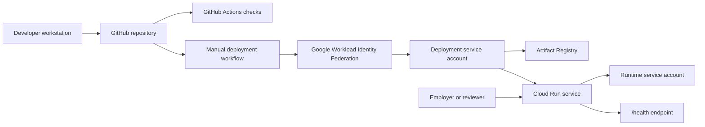

# Architecture Overview

This repository provides a static React Living CV deployed as a containerized nginx service on Google Cloud Run.

## Application

The frontend is a React, TypeScript, and Vite single-page app. Pages are routed with React Router, styled with Tailwind CSS, and backed by structured TypeScript data files in `src/data`.

## Runtime

The production container uses a multi-stage Docker build:

1. Node builds the Vite app.
2. nginx serves the generated `dist` files.
3. nginx listens on the Cloud Run `PORT` environment variable, defaulting to `8080`.
4. SPA routes fall back to `index.html`.
5. `/health` returns a successful plaintext response.

## Infrastructure

Terraform declares required Google Cloud APIs, Artifact Registry, Cloud Run, runtime and deployment service accounts, IAM bindings, and GitHub Workload Identity Federation.

## Delivery

Pull requests run install, lint, type-check, unit tests, and production build. Deployment is prepared as a manual GitHub Actions workflow and does not use service-account JSON keys.
