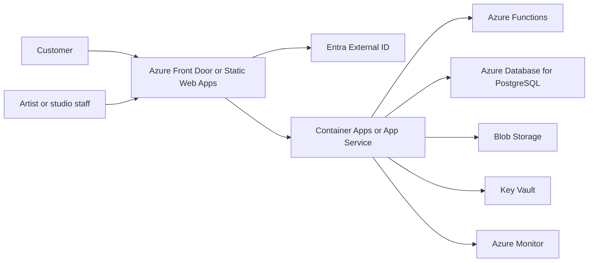

# InkMatch Studio

## Project Summary

InkMatch Studio is a design and prototype-development project for a tattoo-industry marketplace and studio-management platform connecting customer briefs with suitable artists.

## Users

- Customers submitting briefs
- Tattoo artists managing portfolios
- Studio managers
- Reception and support staff

## Assumptions

- The project is a prototype and does not claim live marketplace usage.
- Matching suggestions must remain reviewable by people.
- Customer briefs, images, consent and booking information require careful handling.

## Cloud-Service Mapping

- Azure Front Door or Static Web Apps for frontend delivery
- Entra External ID for identity
- Azure Container Apps or App Service for application APIs
- Azure Functions for asynchronous jobs
- Azure Database for PostgreSQL for relational records
- Blob Storage for images and media
- Key Vault for secrets
- Azure Monitor for observability

## Security Model

Customer information, consent records and image uploads require scoped access, private storage, audit history and secure secrets. Payment deposits require a compliant payment provider before real use.

## Deployment Model

The frontend can be served through Azure Front Door or Static Web Apps. Application APIs can run on Azure Container Apps or App Service, with Azure Functions supporting background processing.

## Testing Approach

Tests should cover brief submission, email and consent validation, secure media upload, role boundaries and consultation booking flows.

## Current Status

Design and prototype development. No production studio adoption or live marketplace activity is claimed.

## Next Technical Milestone

Prototype customer brief submission, artist portfolio views and secure reference-image upload.

