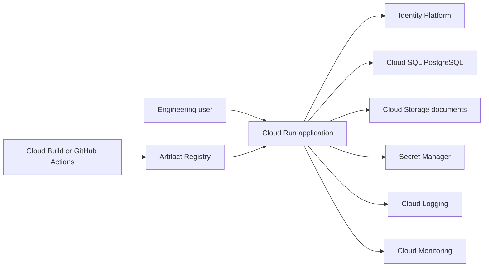

# Pegasus Engineering Platform

## Project Summary

Pegasus Engineering Platform is a concept architecture and secure-system demonstration for engineering, supplier, procurement and asset-lifecycle management in advanced manufacturing and aerospace-style environments.

It does not include operational weapons guidance, classified material, export-controlled details or invented government relationships.

## Users

- Engineering administrators
- Supplier-management teams
- Procurement and inspection staff
- Project managers and technical reviewers
- Maintenance and asset-lifecycle teams

## Assumptions

- The system uses synthetic, non-sensitive demonstration data.
- Role-based access, data classification and audit trails are core design requirements.
- Any real-world compliance or procurement use would require specialist review.

## Cloud-Service Mapping

- Cloud Run for containerized services
- Identity Platform for authentication
- Cloud SQL PostgreSQL for relational records
- Cloud Storage for controlled documents
- Secret Manager for secrets
- Cloud Logging for logs
- Cloud Monitoring for metrics and alerts
- Artifact Registry for images
- Cloud Build or GitHub Actions for CI/CD

## Security Model

The demonstration should enforce least privilege, role-based access, data classification, document-access audit trails and secret isolation. It must avoid classified, export-controlled or operationally sensitive content.

## Deployment Model

Container images are built through Cloud Build or GitHub Actions, stored in Artifact Registry and deployed to Cloud Run. Managed database, storage, IAM and secrets are defined through infrastructure as code.

## Testing Approach

Tests should cover role boundaries, classification logic, audit-event creation, document-control workflows and safe content constraints.

## Current Status

Concept architecture and secure-system demonstration. No production deployment, customer adoption or government relationship is claimed.

## Next Technical Milestone

Build a safe synthetic data model for suppliers, requirements, document control and audit events.

