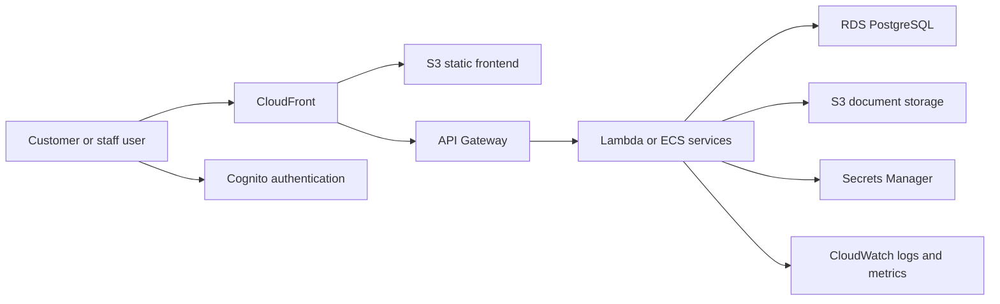

# ServiceFlow Construction

## Project Summary

ServiceFlow Construction is a design and prototype-development project for a multi-tenant field-service and property-maintenance platform. It is intended for builders, plumbers, electricians, gas engineers, surveyors and maintenance companies.

## Users

- Customers and property contacts
- Office coordinators and dispatch staff
- Field engineers and tradespeople
- Business owners and operational managers

## Assumptions

- The project is not production-ready and does not claim production use.
- Tenants require separation of customers, jobs, documents and billing records.
- Uploaded images and documents may contain sensitive customer or property information.

## Cloud-Service Mapping

- CloudFront for edge delivery
- S3 for frontend assets
- Cognito for authentication
- API Gateway for APIs
- Lambda or ECS for application services
- RDS PostgreSQL for relational workflow data
- S3 document storage for uploads
- CloudWatch for logging and monitoring
- Secrets Manager for configuration secrets

## Security Model

Tenant isolation, role-based access, private document storage, file validation, audit history and managed secrets are required design controls.

## Deployment Model

Frontend assets are served through CloudFront and S3. APIs are exposed through API Gateway and implemented with Lambda or ECS. Database and storage resources are provisioned through infrastructure as code.

## Testing Approach

Unit tests should cover validation and workflow rendering. Integration tests should cover tenant-aware API access. End-to-end tests should cover enquiry, quote, scheduling and job-update flows.

## Current Status

Design and prototype development. No production customers or production usage are claimed.

## Next Technical Milestone

Build a minimal enquiry-to-job prototype with tenant-aware data access and audit-event creation.

